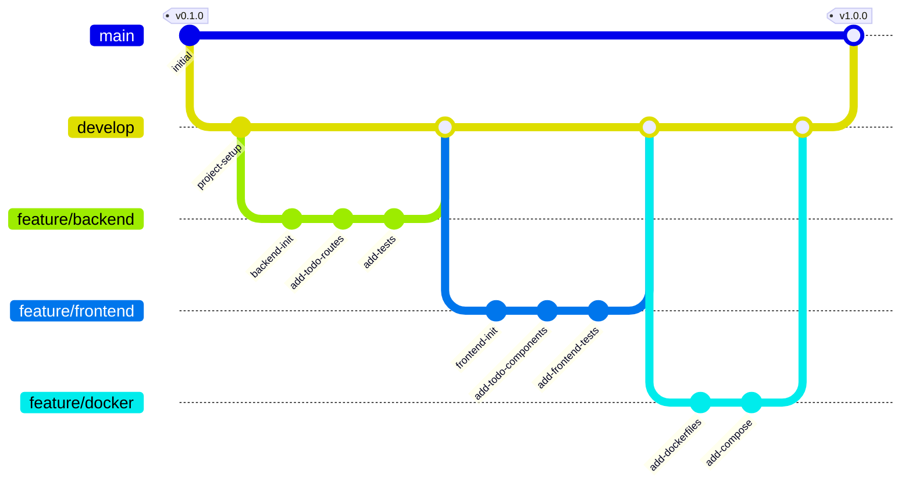

# Todo App with Node.js and Docker


[](./backend/coverage/lcov-report/index.html)
[](./frontend/coverage/lcov-report/index.html)

A full-featured Todo List application built with Node.js, Express, and React, fully containerized with Docker.

## Security and Testing

### Security Scans

We regularly perform security scans using multiple tools:
- Snyk for dependency vulnerability scanning
- Azure Container Scan for Docker image scanning
- Trivy for filesystem scanning
- npm audit for package vulnerabilities

Security scan results are available in the GitHub Actions tab under the 'Security Scan' workflow.

### Test Results

Test results and coverage reports are automatically generated and published:
- Coverage reports: Available in GitHub Actions artifacts
- Test results: Published as workflow artifacts
- Coverage badges: Updated automatically in README

View detailed security information in our [Security Policy](SECURITY.md).

## Features

- Create, Read, Update, and Delete todos
- Mark todos as complete/incomplete
- Filter todos by status
- Containerized application with Docker
- Comprehensive test coverage with Jest
- OpenAPI documentation
- GitHub Actions CI/CD pipeline

## Project Structure

```
todo-app-nodejs-docker/
├── backend/                 # Node.js + Express backend
│   ├── src/                # Source files
│   ├── tests/              # Test files
│   └── Dockerfile         # Backend Docker configuration
├── frontend/               # React frontend
│   ├── src/               # Source files
│   ├── tests/             # Test files
│   └── Dockerfile         # Frontend Docker configuration
├── docker-compose.yml      # Docker compose configuration
└── README.md              # This file
```

## API Documentation

API documentation is available in OpenAPI format. You can view it by:

1. Opening the `backend/openapi.yaml` file
2. Using tools like Swagger UI to visualize the documentation

## Development Workflow



## Getting Started

### Prerequisites

- Node.js 18.x or higher
- Docker and Docker Compose
- npm or yarn

### Development Setup

1. Clone the repository:
   ```bash
   git clone https://github.com/ajeetraina/todo-app-nodejs-docker.git
   cd todo-app-nodejs-docker
   ```

2. Install dependencies:
   ```bash
   # Install backend dependencies
   cd backend
   npm install

   # Install frontend dependencies
   cd ../frontend
   npm install
   ```

3. Run tests:
   ```bash
   # Backend tests
   cd backend
   npm test

   # Frontend tests
   cd frontend
   npm test
   ```

### Running with Docker

```bash
docker-compose up --build
```

The application will be available at:
- Frontend: http://localhost:3000
- Backend API: http://localhost:3001

## Test Coverage and Security Results

Test results and coverage reports are available in the respective `coverage` directories:
- Backend: `backend/coverage/`
- Frontend: `frontend/coverage/`

To view security scan results:
1. Go to GitHub Actions tab
2. Select 'Security Scan' workflow
3. Download artifacts for detailed reports

## Contributing

Please read [CONTRIBUTING.md](CONTRIBUTING.md) for details on our code of conduct and the process for submitting pull requests.

## License

This project is licensed under the Apache 2.0 License - see the [LICENSE](LICENSE) file for details.